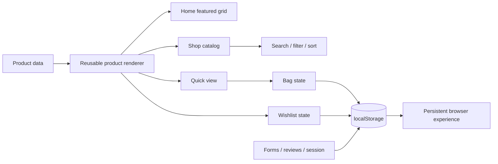

<p align="center">
  
</p>

<p align="center">
  
  
  
  
  
  
</p>

<p align="center">
  <strong>Search2Get</strong> is my first-year frontend project rebuilt into a polished, editorial fashion-discovery storefront — while deliberately keeping the same vanilla HTML, CSS and JavaScript foundation.
</p>

---

## The project in one sentence

**A visible before → after story of frontend growth.**

The original 2023 version was written completely by hand as a first-year project. Instead of deleting that history or hiding it behind a framework, the current version keeps the original stack and pushes it much further with stronger product thinking, responsive systems, state, accessibility, interaction design and a completely new visual direction.

> **2023:** static first-year storefront  
> **2026:** responsive, stateful, editorial shopping experience

## Visual direction

The V3 refresh replaces the old low-resolution imagery with responsive high-resolution editorial photography and a warmer, fashion-led art direction.

<table>
  <tr>
    <td width="33%"></td>
    <td width="33%"></td>
    <td width="33%"></td>
  </tr>
</table>

The storefront requests multiple image widths (`640 / 960 / 1400 / 2000px`) with `srcset`, so the visual upgrade stays sharp without blindly serving desktop-size media to every device.

> Photography sources and licensing are documented in [`IMAGE_CREDITS.md`](./IMAGE_CREDITS.md).

## What actually works

| Experience | Implementation |
| --- | --- |
| Product discovery | Instant search, Men/Women filters and price/rating sorting |
| Product detail | Quick-view modal, size selection and product metadata |
| Shopping bag | Add/remove, quantity controls, totals and persistent state |
| Wishlist | Persistent favourites across page refreshes |
| Checkout | Multi-field validated checkout simulation + confirmation state |
| Theme | Light/dark mode persisted locally |
| Reviews | Publish a local review and render it immediately |
| Contact | Validated local-only contact interaction |
| Newsletter | Browser-local subscription interaction |
| Member space | Local session flow with validation and password visibility |
| Navigation | Responsive desktop/mobile navigation |
| Accessibility | Semantic structure, focus states, keyboard-aware overlays and reduced-motion support |
| Error handling | Custom 404 page + legacy-route compatibility redirects |

## Why the project stays vanilla

This is intentional.

Rebuilding the app in React would make it a different project. Keeping HTML, CSS and JavaScript makes the progression more meaningful because the improvement comes from **better fundamentals**, not from replacing the foundation.

The current build demonstrates:

- responsive layout systems instead of fixed-pixel composition
- DOM-driven reusable product rendering
- client-side state modelling
- Web Storage persistence
- search / filter / sort logic
- modal and drawer lifecycle handling
- form validation and feedback states
- accessible interaction patterns
- responsive image delivery
- visual hierarchy, motion and editorial art direction

## Architecture



## V3 design system

The modern storefront is layered rather than destructive:

- `index.css` contains the rebuilt core UI system
- `v3.css` adds the premium editorial art direction
- `index.js` owns the product/state/interaction logic
- `visual-refresh.js` upgrades legacy image references to responsive high-resolution sources

That separation keeps the project history understandable while making the latest experience significantly sharper.

## Pages

| Route | Purpose |
| --- | --- |
| `index.html` | Editorial landing page + featured products |
| `shop.html` | Search, filter, sort and catalog browsing |
| `journal.html` | Fashion editorial + project build story |
| `reviews.html` | Review showcase + local publishing |
| `contact.html` | Contact interaction + project FAQ |
| `account.html` | Local member/session experience |
| `404.html` | Custom not-found page |

Legacy first-year routes remain as lightweight compatibility redirects so old links do not simply break.

## Run locally

No package installation or build step is required.

```bash
python -m http.server 8000
```

Then open:

```text
http://localhost:8000
```

## Privacy / demo boundary

Search2Get is a frontend portfolio project, not a production ecommerce service.

- no real payment is processed
- no server-side account is created
- credentials are not sent to a backend
- cart, wishlist, reviews, contact entries, newsletter entries and local-session state are browser-local

## Repository history matters

The earliest commits are intentionally still here.

They show the original first-year implementation before the redesign, which makes this repository more useful than a clean-room rewrite: it documents how the same developer and the same core technologies evolved from a beginner build into a substantially stronger frontend product.

## Credits & license

Project code is available under the [MIT License](./LICENSE).

Editorial photography is **not** covered by the project MIT license. See [`IMAGE_CREDITS.md`](./IMAGE_CREDITS.md) for photographers, source pages and Unsplash licensing information.

---

<p align="center">
  Designed and built by <strong>Rishikesh Munnaluri</strong><br/>
  <sub>Original first-year build + modern rebuild — handwritten HTML, CSS and JavaScript.</sub>
</p>
