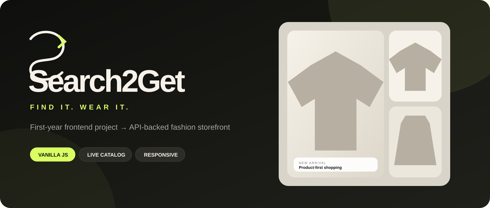
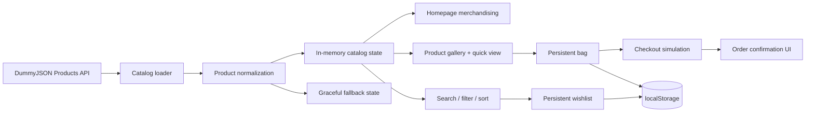

<p align="center">
  
</p>

<h1 align="center">Search2Get</h1>
<p align="center"><strong>My first-year frontend project, rebuilt into an API-backed fashion storefront.</strong></p>

<p align="center">
  
  
  
  
  
</p>

---

## The project in one line

**Search2Get V4 is a responsive, product-first ecommerce frontend that loads a live apparel catalog and turns it into a complete shopping experience using only HTML, CSS and vanilla JavaScript.**

The repository deliberately preserves the original 2023 first-year implementation in Git history. The point is not to hide beginner work — it is to make the growth obvious.

> **2023:** static hand-written frontend → **2026:** API catalog, responsive design system, persistent shopping state, product gallery, search/filter/sort, wishlist, cart and checkout simulation.

## Why V4 exists

Earlier rebuilds made the old project prettier, but they still felt like a portfolio demo wearing ecommerce clothes. V4 changes the architecture and art direction around one principle:

> **Make the product feel like a store first. Explain the portfolio story second.**

That means no random fashion-model hero photography and no manually invented eight-item catalog. The active visual system is built around the products returned by the catalog API.

## Storefront experience

| Area | What works |
| --- | --- |
| Catalog | Live apparel products loaded from DummyJSON |
| Product imagery | Product thumbnails + multi-image product galleries |
| Discovery | Search by product, brand or category |
| Collections | Women / Men / Accessories |
| Category filtering | Shirts, dresses, shoes, bags, watches, jewellery, sunglasses, tops |
| Sorting | Featured, biggest discount, rating, price low/high |
| Product detail | Quick-view gallery, description, stock, shipping, returns, sizes |
| Wishlist | Persistent via `localStorage` |
| Bag | Persistent items, sizes, quantities and calculated totals |
| Delivery | Free-shipping threshold with visual progress |
| Checkout | Validated delivery form + payment-method simulation + confirmation |
| Theme | Light / dark mode |
| Search overlay | Global storefront search from the header |
| Reliability | Loading skeletons, empty states, API fallback, image fallback |
| Accessibility | Semantic controls, labels, keyboard Escape behavior, reduced motion |
| Mobile | Reflowed navigation, filters, cards, modals and checkout |

## Product data, not decorative stock photos

Search2Get fetches fashion/ecommerce records from the public **DummyJSON Products API**. The selected categories include:

```text
mens-shirts          womens-dresses
mens-shoes           womens-shoes
mens-watches         womens-bags
tops                  womens-jewellery
sunglasses            womens-watches
```

The frontend normalizes each API record into one Search2Get product model containing:

```js
{
  id,
  name,
  brand,
  segment,
  category,
  categoryLabel,
  description,
  image,
  images,
  price,
  oldPrice,
  discount,
  rating,
  stock,
  availability,
  shipping,
  returnPolicy,
  sizes
}
```

That same model powers the **homepage, category merchandising, catalog, search, product modal, wishlist, bag and checkout**.

See [`DATA_SOURCE.md`](DATA_SOURCE.md) for the complete data-source and normalization notes.

## Architecture



## Visual system

V4 introduces a new Search2Get identity instead of reusing the old iconography:

- custom **Search2Get wordmark** and favicon
- black / warm-neutral / acid-lime palette
- product-first merchandising surfaces
- `Manrope` display typography + `DM Sans` interface typography
- consistent rounded commerce controls
- responsive four/three/two-column product grids
- product-image `object-fit: contain` treatment so garments remain the focus
- restrained motion instead of animation for animation's sake
- dark mode with product surfaces kept readable

The main design system lives in [`storefront.css`](storefront.css).

## Repository structure

```text
Search2get_initial/
├─ assets/
│  ├─ favicon.svg
│  ├─ search2get-logo.svg
│  └─ readme-banner.svg
├─ index.html              # Storefront homepage
├─ shop.html               # API-backed catalog
├─ journal.html            # Build / product story
├─ reviews.html            # Local review experience
├─ contact.html            # Customer-care + FAQ demo
├─ account.html            # Local session demo
├─ 404.html                # Branded not-found page
├─ storefront.css          # V4 design system
├─ store.js                # Catalog + shopping application logic
├─ DATA_SOURCE.md          # API / data documentation
├─ LICENSE
└─ vercel.json
```

Legacy first-year route names remain as tiny compatibility redirects so old links do not immediately break. The original implementation and assets remain recoverable through Git history instead of cluttering the active V4 storefront.

## Shopping flow

1. Load the live apparel catalog.
2. Browse the homepage product edit or open **Shop**.
3. Search, select a collection, narrow by category and sort.
4. Open **Quick view**.
5. Browse product images and inspect stock / shipping / return details.
6. Select a size.
7. Save to wishlist or add to bag.
8. Adjust quantities in the bag.
9. Watch the free-shipping progress update.
10. Open checkout and validate delivery details.
11. Choose a demo payment option.
12. Place a simulated order and receive a local confirmation reference.

## Failure states are part of the product

A polished frontend should not collapse when one network request fails.

Search2Get includes:

- catalog loading skeletons
- a built-in fallback product edit
- visible API fallback notice
- product image replacement if a remote image fails
- empty search/filter state with reset action
- cart cleanup when stale product IDs no longer exist
- safe `localStorage` parsing

## Local state

These flows intentionally use browser storage:

```text
cart
wishlist
theme
reviews
demo account session
newsletter entry
contact messages
```

This allows the frontend to feel stateful without pretending a backend exists.

## Important project boundary

Search2Get is a **portfolio ecommerce frontend**, not a real merchant.

- DummyJSON provides sample ecommerce data for prototyping.
- INR amounts are presentation values derived for this interface.
- No inventory is owned by Search2Get.
- No account is created on a server.
- No payment gateway is connected.
- No card is charged.
- Contact/review/newsletter/account demo information stays in browser storage.

Those limits are intentional and are communicated inside the product where they matter, without turning every storefront section into a disclaimer.

## Run locally

There is no dependency install and no build step.

```bash
python -m http.server 8000
```

Then open:

```text
http://localhost:8000
```

Internet access is required for the live product API and Google Fonts. If the catalog request fails, the built-in fallback catalog is used automatically.

## Main files worth reviewing

### `store.js`

The application layer: API loading, product normalization, merchandising, filters, quick-view galleries, wishlist, cart, checkout, forms, fallbacks and shared chrome.

### `storefront.css`

The full visual system: tokens, navigation, hero, catalog, product cards, responsive behavior, modal/drawer UX, forms, dark mode and secondary pages.

### `index.html` + `shop.html`

The two primary product surfaces, intentionally kept semantic and framework-free.

## What this repository demonstrates

This is not meant to prove that vanilla JavaScript should replace every framework. It demonstrates that I understand the fundamentals beneath frameworks:

- DOM rendering
- async API consumption
- normalization of external data
- client state design
- persistence
- derived UI state
- responsive layout systems
- component-like reusable markup generation
- interaction states
- graceful failure handling
- accessibility basics
- product and visual hierarchy

## Project history

The original project was created in my first year and written manually in HTML, CSS and JavaScript. That version is intentionally preserved in the repository history.

The V4 rebuild is the current answer to a simple question:

**“What would I build today if I kept the same project idea, but applied everything I learned afterward?”**

---

<p align="center"><strong>Designed and built by Rishikesh Munnaluri.</strong><br>Original first-year project + complete V4 rebuild.</p>
